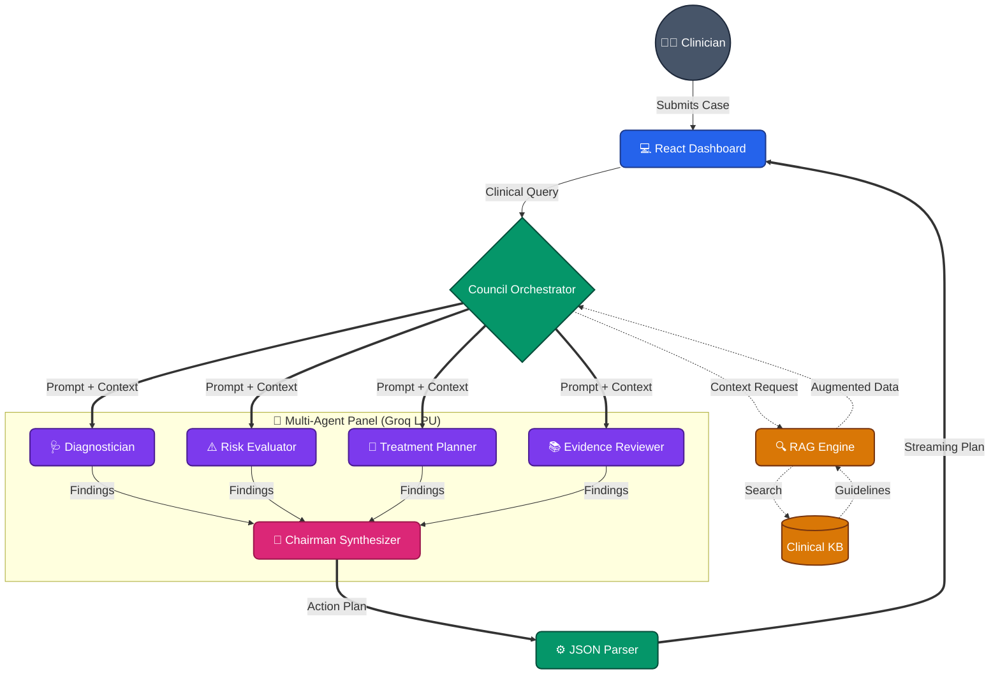

# MedCouncil AI: Multi-Agent Medical Decision Simulation


**MedCouncil AI** is a research prototype that simulates a multi-agent medical tumor board / expert council. It leverages state-of-the-art Large Language Models (LLMs) running on ultra-fast Groq LPU inference to dynamically evaluate clinical cases. By distributing cognitive load across specialized personas and utilizing Retrieval-Augmented Generation (RAG), this system explores the efficacy of collaborative AI in complex clinical decision-making.

## ✨ Key Features

- **Concurrent Agent Execution:** Utilizes multiple LLM personas simultaneously to prevent tunneling and ensure broad differential diagnostic reasoning.
- **Sub-Second RAG Injection:** Contextualizes patient queries against in-memory clinical guidelines before LLM processing.
- **Conflict Resolution Synthesis:** Employs a 'Chairman' meta-agent to synthesize divergent opinions and strictly format output as parseable JSON mappings for the UI.
- **Privacy-First Architecture:** Local orchestrator guarantees that data is appropriately scrubbed and anonymized in flight.

## 🔬 Research Focus & Objectives

This repository serves as a foundation for researching AI applications in healthcare workflows, focusing on:
- **Multi-Agent Orchestration:** Evaluating how distinct, strictly prompted expert agents (Diagnostician, Risk Evaluator, Treatment Planner, Evidence Reviewer) can surface diverse clinical insights and mitigate individual model biases.
- **In-Memory RAG (Retrieval-Augmented Generation):** Testing the impact of deterministic clinical context injection (simulating FDA labels and medical guidelines) to reduce hallucination rates.
- **Structured Output Reliability:** Utilizing `json_object` enforcement across parallel agents to guarantee heavily structured, parseable clinical data streams.
- **High-Speed Inference:** Leveraging the Groq API (e.g., `mixtral-8x7b-32768`) to allow near-instantaneous parallel agent reasoning for real-time UI mapping.

## 🏛 Architecture Overview

This project is organized into a modern client/service architecture with:
- a React/Vite dashboard for clinical interaction,
- a TypeScript orchestrator for multi-agent prompt routing,
- a lightweight in-memory retrieval layer for clinical context injection,
- and a Groq-backed inference pipeline for fast multi-agent reasoning.

*For full architectural details, sequence diagrams, and future scalability considerations, please refer to [SYSTEM_ARCHITECTURE.md](./SYSTEM_ARCHITECTURE.md).*



### The Agents
1. **Diagnostician Agent:** Identifies potential underlying conditions and differential diagnoses.
2. **Risk Evaluator Agent:** Flags contraindications, drug interactions, and patient safety risks.
3. **Treatment Planner Agent:** Suggests evidence-based pharmacological and procedural interventions.
4. **Evidence Reviewer Agent:** Validates the council's suggestions against the injected RAG knowledge base.
5. **Chairman Synthesizer:** Aggregates all findings, resolves clinical contradictions, and publishes the final Medical Action Plan.

## 📁 Project Structure

```text
medcouncil-ai/
├── src/
│   ├── components/       # React UI components
│   ├── hooks/            # Custom state hooks (e.g., useLocalStorage.ts)
│   ├── services/
│   │   ├── councilService.ts  # Multi-agent orchestrator & Groq API bindings
│   │   └── ragService.ts      # In-memory search & context injection
│   ├── App.tsx           # Main application entry point
│   └── main.tsx          # React DOM bindings
├── SYSTEM_ARCHITECTURE.md # Deep-dive documentation on agent design
├── vite.config.ts        # Vite build configuration
└── package.json          # Dependency mapping
```

## 🚀 Getting Started

**Prerequisites:**  Node.js (v18+)

1. **Install Dependencies:**
   ```bash
   npm install
   ```

2. **Environment Setup:**
   Create a `.env` or `.env.local` file in the root directory:
   ```env
   VITE_GROQ_API_KEY=your_groq_api_key_here
   ```

3. **Run the Application:**
   ```bash
   npm run dev
   ```
   The interactive medical dashboard will compile and be available locally (usually at `http://localhost:5173`).

## 🛠 Tech Stack
- **Frontend / UI:** React, Vite, TailwindCSS
- **AI Orchestration:** Native TypeScript (`src/services/councilService.ts`)
- **Retrieval System:** Custom lightweight In-Memory RAG (`src/services/ragService.ts`)
- **Inference Engine:** Groq API (`groq-sdk`)

## ⚠️ Disclaimer
**For Academic & Research Purposes Only.** This software is an experimental AI simulation. It is NOT approved for real-world medical diagnosis, treatment, or clinical deployment. Do not input real Protected Health Information (PHI). Always consult a qualified medical professional for actual health-related decisions.
