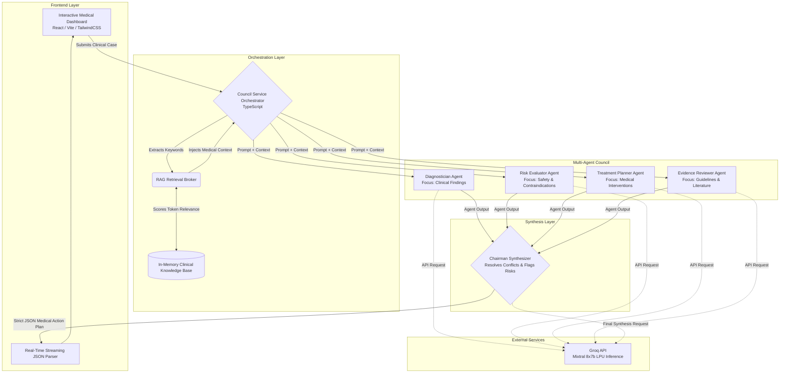
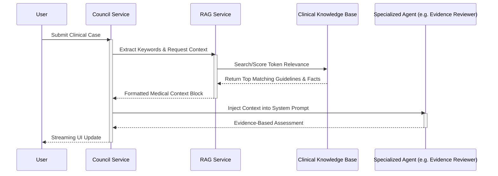

# System Architecture & AI Integration

## 1. High-Level Architecture
The application simulates a medical council using a multi-agent AI architecture. It dynamically routes clinical queries across specialized expert personas to deliver a synthesized, evidence-backed treatment plan.

- **Frontend Layer:** Built with React (via Vite) and TailwindCSS. It provides a real-time, interactive medical dashboard where continuous AI streams and specialized agent reasoning are displayed clearly.
- **Service/Orchestration Layer:** Written in strict TypeScript. `src/services/councilService.ts` acts as the routing orchestrator—managing prompt engineering, execution state, strict JSON parsing, and context assembly across the AI council.
- **AI Engine:** Powered by the Groq API (`groq-sdk`), delivering high-speed LPU inference using state-of-the-art open-weights models (e.g., `mixtral-8x7b-32768`) enforced with JSON-mode output constraints.

### 2. Multi-Agent Council Workflow
- **The Expert Panel:** Four distinct specialized personas (Diagnostician, Risk Evaluator, Treatment Planner, Evidence Reviewer) evaluate the topic independently. Each agent processes the discussion history and applies their unique clinical lens.
- **The Chairman Synthesizer:** A master routing agent that evaluates the cumulative outputs of the expert panel. The Chairman resolves clinical conflicts, flags critical safety risks (contraindications), and outputs a highly structured final medical action plan.

**Workflow Diagram:**

## 3. Migration to Groq API
- **Previous State:** The application used `@google/genai` (Google Gemini API) and its native structured output schemas.
- **Current State:** Migrated to the `groq-sdk` to leverage the LPU hardware engine for exponentially faster inference.
- **Implementation Details:**
  - Replaced the `GoogleGenAI` client initialization with the `Groq` client.
  - Refactored system prompts to explicitly document constraints and required JSON object hierarchies, as Groq utilizes standard OpenAI-aligned completions.
  - Formatted API calls to leverage `groq.chat.completions.create` utilizing `response_format: { type: "json_object" }` to guarantee strict JSON payload decoding for real-time UI components.
  - Updated environment variable definitions in `.env.example` (swapping `GEMINI_API_KEY` for `GROQ_API_KEY`).

## 4. In-Memory RAG (Retrieval-Augmented Generation) Implementation
- **Overview:** Added a dependency-free, lightweight RAG pipeline to ground the AI Council's medical reasoning and reduce hallucinations, simulating a production-grade vector workflow.
- **Implementation Strategy:**
  - Designed `src/services/ragService.ts` as the retrieval broker.
  - Implemented an in-memory clinical knowledge-base (`KNOWLEDGE_BASE`) containing highly structured clinical guidelines and medication facts.
  - Engineered a local retrieval engine (`retrieveMedicalContext`) utilizing normalized, mapped token counting to score document relevancy against natural language input.
  - Hard-integrated the retrieval pipeline into `councilService.ts`. The medical context is dynamically queried and concatenated directly into the `SystemInstruction` context block of individual sub-agents and the overarching Chairman before LLM payload generation.

**Research & Context Retrieval Sequence:**

## 5. Future Scalability (Production Architecture)
- **Vector Database Migration:** Transition the static in-memory array (`ragService.ts`) to a highly scaled, persistent vector database such as ChromaDB (Local/TypeScript), Pinecone (Cloud), or pgvector (Supabase).
- **Mathematical Embeddings Integration:** Introduce dense embedding models (e.g. `nomic-embed-text` or `text-embedding-3-small` via LangChain.js) to compute true cosine-similarity semantic vector distances instead of token matching.
- **Automated Document Ingestion Pipelines:** Create serverless ingestion scripts (e.g. specialized Vercel Functions/AWS Lambdas) capable of extracting, chunking natively, and uploading raw clinical PDFs (e.g. FDA drug labels, NICE, WHO) directly into the Vector Store index.